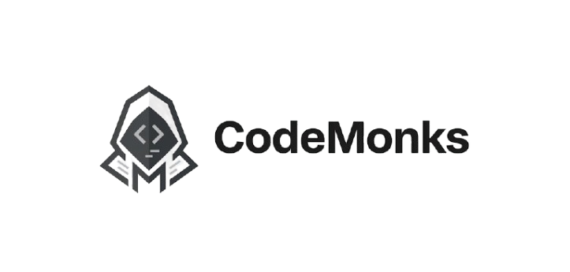

# CodeMonks (codemonks.xyz) - Digital Product Studio

A modern, high-performance agency website built for **CodeMonks**, a freelance digital product agency specializing in strategy, design, and engineering for ambitious startups.



---

## 📖 Project Overview

This is a **freelance project** developed for **CodeMonks (codemonks.xyz)**, showcasing their comprehensive digital product services including AI & Machine Learning, Full-Stack Development, Mobile Apps, Cloud Architecture, and more.

The website features:
- 🎨 Modern, minimalist design with smooth animations
- 🚀 High-performance Next.js 16 architecture
- 📱 Fully responsive layout
- ⚡ React Compiler for optimized performance
- 🎭 Motion-powered animations
- 🌐 Multi-page routing with work portfolio
- 📧 Integrated contact form
- 🔍 SEO-optimized structure

---

## ✨ Features

### Core Pages
- **Home** - Hero section, services showcase, projects, testimonials, FAQ, and CTA
- **Services** - Detailed service offerings with interactive cards
- **Work Portfolio** - Dynamic project showcases (`/work/[slug]`)
- **Contact** - Contact form with EmailJS integration
- **Privacy Policy** - Legal compliance page
- **Terms of Service** - Terms and conditions page

### Key Components
- **Navbar** - Responsive navigation with smooth scroll
- **Hero Section** - Eye-catching introduction with animated text
- **Logo Marquee** - Client/partner logo showcase
- **Features** - Key value propositions
- **Services** - 9 service categories with detailed descriptions
- **Projects** - Portfolio showcase with project cards
- **Testimonials** - Client feedback section
- **FAQ** - Frequently asked questions
- **CTA** - Call-to-action sections
- **Footer** - Links, social media, and legal information

### Technical Highlights
- ✅ **Next.js 16** - Latest version with App Router
- ✅ **React 19** - Cutting-edge React features
- ✅ **TypeScript** - Full type safety
- ✅ **Tailwind CSS v4** - Modern utility-first styling
- ✅ **Motion** - Smooth animations and transitions
- ✅ **React Compiler** - Automatic performance optimizations
- ✅ **EmailJS** - Client-side email functionality
- ✅ **Custom Fonts** - Bricolage Grotesque, DM Sans, DM Mono, Inter
- ✅ **Shadcn UI** - Accessible component library
- ✅ **Lucide Icons** - Beautiful icon set

---

## 🛠️ Tech Stack

### Frontend
- **Framework:** Next.js 16.2.0
- **Language:** TypeScript 5.x
- **Styling:** Tailwind CSS v4
- **Animations:** Motion (formerly Framer Motion)
- **UI Components:** Shadcn, Radix UI
- **Icons:** Lucide React
- **Fonts:** 
  - Bricolage Grotesque (Headings)
  - Inter (Sans-serif)
  - DM Sans & DM Mono (Accents)

### Backend & Integration
- **Email Service:** EmailJS Browser SDK
- **Video:** HTML5 Video (Hero background)
- **Image Optimization:** Sharp

### Build & Development
- **Bundler:** Next.js Webpack
- **Compiler:** Babel with React Compiler plugin
- **CSS Processing:** PostCSS v4
- **Lightning CSS:** Fast CSS transformation

---

## 📦 Installation

### Prerequisites
- Node.js 20+ 
- npm or yarn

### Setup

1. **Clone the repository**
```bash
git clone <repository-url>
cd agency
```

2. **Install dependencies**
```bash
npm install
```

3. **Set up environment variables**

Create a `.env.local` file in the root directory:
```env
# EmailJS Configuration
NEXT_PUBLIC_EMAILJS_SERVICE_ID=your_service_id
NEXT_PUBLIC_EMAILJS_TEMPLATE_ID=your_template_id
NEXT_PUBLIC_EMAILJS_PUBLIC_KEY=your_public_key
```

4. **Run the development server**
```bash
npm run dev
```

5. **Open your browser**
Navigate to [http://localhost:3000](http://localhost:3000)

---

## 🚀 Available Scripts

| Command | Description |
|---------|-------------|
| `npm run dev` | Start development server with hot reload |
| `npm run build` | Create production build |
| `npm run start` | Start production server |
| `npm run lint` | Run ESLint for code quality |

---

## 📁 Project Structure

```
agency/
├── app/                      # Next.js App Router
│   ├── contact/             # Contact page
│   ├── privacy/             # Privacy policy page
│   ├── services/            # Services page
│   ├── terms/               # Terms page
│   ├── work/[slug]/         # Dynamic project pages
│   ├── globals.css          # Global styles
│   ├── layout.tsx           # Root layout
│   └── page.tsx             # Home page
├── components/              # React components
│   ├── ui/                  # Reusable UI components
│   ├── CTA.tsx              # Call-to-action component
│   ├── Contact.tsx          # Contact form
│   ├── FAQ.tsx              # FAQ section
│   ├── Features.tsx         # Features showcase
│   ├── Footer.tsx           # Site footer
│   ├── Hero.tsx             # Hero section
│   ├── LogoMarquee.tsx      # Client logo carousel
│   ├── Navbar.tsx           # Navigation bar
│   ├── ProjectCard.tsx      # Project display card
│   ├── ProjectMarquee.tsx   # Project carousel
│   ├── Projects.tsx         # Projects section
│   ├── ServiceCard.tsx      # Service card
│   ├── Services.tsx         # Services section
│   ├── Testimonials.tsx     # Client testimonials
│   ├── projectsData.ts      # Project data
│   └── servicesData.ts      # Service data
├── hooks/                   # Custom React hooks
│   └── useInView.ts         # Scroll detection hook
├── lib/                     # Utilities
│   └── utils.ts             # Helper functions
├── public/                  # Static assets
│   ├── marquee/             # Client logos
│   ├── hero.mp4             # Hero video background
│   └── agencyLogo.png       # Agency logo
├── .env.local               # Environment variables
├── next.config.ts           # Next.js configuration
├── tailwind.config.ts       # Tailwind configuration
└── tsconfig.json            # TypeScript configuration
```

---

## 🎨 Design System

### Color Palette
The design uses a sophisticated color system with:
- Background colors with transparency
- Muted text for secondary content
- Chart colors for visual hierarchy
- Border colors for subtle separation

### Typography
- **Headings:** Bricolage Grotesque (400-800 weight)
- **Body:** Inter (sans-serif)
- **Mono:** DM Mono (code/technical elements)
- **Accents:** DM Sans

### Animations
- Fade-up animations for content reveal
- Smooth scroll behavior
- Hover effects on interactive elements
- Marquee animations for logos and projects
- Motion-powered transitions

---

## 📄 Services Offered

CodeMonks provides 9 core services:

1. **AI & Machine Learning** - OpenAI, PyTorch, TensorFlow, LLMs
2. **Full-Stack Development** - React, Next.js, Node.js, PostgreSQL
3. **Mobile App Development** - React Native, Swift, Kotlin, Flutter
4. **AI Agents & Automation** - n8n, Zapier, Python, Automation
5. **Cloud Architecture** - AWS, GCP, Azure, Terraform
6. **Data Engineering** - Spark, Kafka, Snowflake, ETL
7. **API Development** - GraphQL, REST, gRPC, NestJS
8. **Staff Augmentation** - Engineering talent scaling
9. **Additional specialized services**

---

## 🔧 Configuration

### Next.js Configuration
Located in `next.config.ts`:
- React Compiler enabled for automatic optimizations
- Custom webpack configuration available

### Tailwind CSS v4
Using the latest Tailwind with:
- Custom font families
- Extended color palette
- Custom animations
- Responsive breakpoints

### TypeScript
Strict type checking with custom type definitions in `next-env.d.ts`

---

## 🌐 Deployment

### Recommended Platforms
- **Vercel** - Optimal for Next.js applications
- **Netlify** - Alternative deployment option
- **AWS/GCP/Azure** - Custom cloud deployments

### Build for Production
```bash
npm run build
npm run start
```

### Environment Variables in Production
Ensure all EmailJS credentials and other secrets are configured in your hosting platform's environment settings.

---

## 📱 Browser Support

- Chrome (latest)
- Firefox (latest)
- Safari (latest)
- Edge (latest)
- Mobile browsers (iOS Safari, Chrome Mobile)

---

## 🤝 Contributing

This is a **freelance project** for CodeMonks (codemonks.xyz). For contributions or modifications:

1. Fork the repository
2. Create a feature branch
3. Make your changes
4. Test thoroughly
5. Submit a pull request

---

## 📞 Contact & Support

For inquiries about CodeMonks services or this project:

- **Website:** [https://codemonks.xyz](https://codemonks.xyz)
- **Email:** [Your contact email]
- **Location:** [Your business location]

---

## 📄 License

This project is proprietary software developed for CodeMonks. All rights reserved.

**Copyright © 2026 CodeMonks (codemonks.xyz). All Rights Reserved.**

---

## 🙏 Acknowledgments

- **Next.js Team** - Amazing framework
- **Vercel** - Hosting and deployment platform
- **Tailwind CSS** - Styling framework
- **Motion** - Animation library
- **Shadcn** - UI components
- **EmailJS** - Email integration service
- **Lucide** - Icon library
- **Font Sources** - Bricolage Grotesque, DM Sans, DM Mono, Inter

---

## 📊 Performance Metrics

- ⚡ **Lighthouse Score:** 95+ (Target)
- 🚀 **First Contentful Paint:** < 1.5s
- 💨 **Time to Interactive:** < 3.5s
- ♿ **Accessibility:** 100%
- 🎯 **SEO:** 100%
- 📱 **Mobile-Friendly:** Yes

---

## 🔄 Updates & Maintenance

### Version History
- **v0.1.0** - Initial release
  - Complete agency website
  - All core features implemented
  - Production-ready codebase

### Future Enhancements
- [ ] Blog section integration
- [ ] CMS integration (Sanity/Contentful)
- [ ] Multi-language support
- [ ] Advanced analytics dashboard
- [ ] Admin panel for content management
- [ ] Enhanced project filtering

---

**Built with ❤️ for CodeMonks (codemonks.xyz)**

*This is a freelance project showcasing modern web development excellence.*
